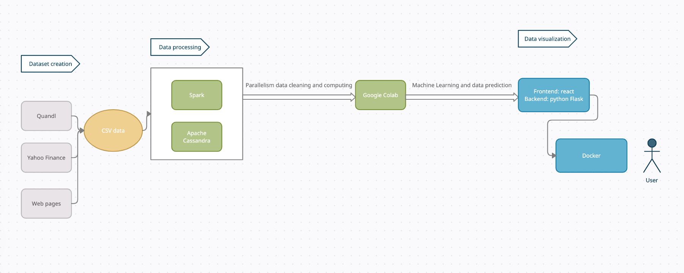

# CPMT732 Final Project
This project is designed for rookie investors, which help them better understand the capital market from the Macro Index, such as S&P 500 index. From the selected stocks in S&P 500, we made further analysis show them how to choose good-quality stocks. According to our outcomes, our project is good tool to let people understand the correlation of macro index and the economy, the trend and forecast of stocks, and how to choose the right time to invest.

## Topic:   
S&P 500 index & stock analysis and forecast for beginners

## UML

## Data Introduction
|  Data   | Brief Introduction  |
|  ----  | ----  |
| sp500_index  | Detailed info of the S&P 500 index from 2012-01 to 2022-11 |
| sp500_companies | The 500 of the largest companies make up for S&P 500 |
| Selected high-quality stocks | AAPL, AMZN, GOOGL, MSFT, NVDA|

## Tools
**Data processing for Big data:**\
Spark(https://spark.apache.org/) 

**Database:**\
Cassandra(https://cassandra.apache.org/_/index.html)

**Frontend:** \
React framework(https://reactjs.org/)  
Apache echarts(https://echarts.apache.org/)  
React-bootstrap(https://react-bootstrap.github.io/)  

**Backend:**\
Python Flask framework(https://flask.palletsprojects.com/en/2.2.x/)

**Application containerization:**\
Docker(https://www.docker.com/)

## Team Members
Jianan Li, jla878 \
Xiner Qian, xqa12 \
Wenzheng Chen, wca132 \
Haimo Xu, hxa31 
 
